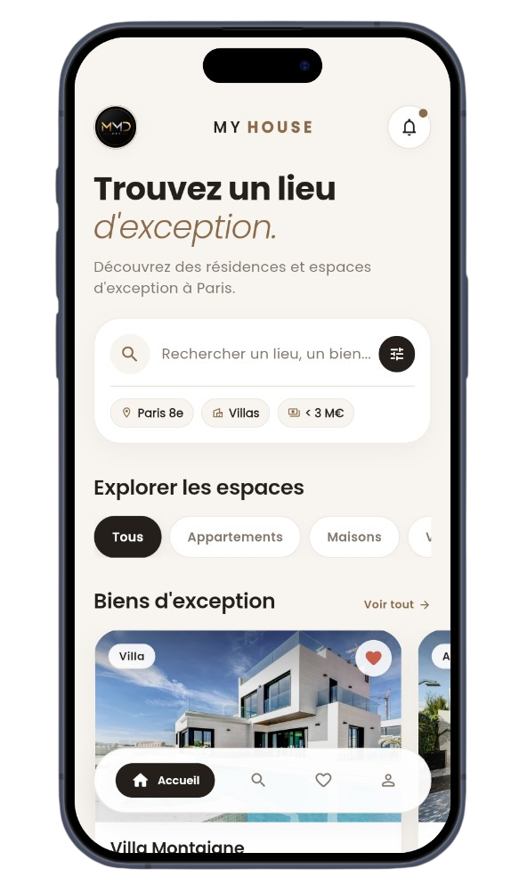
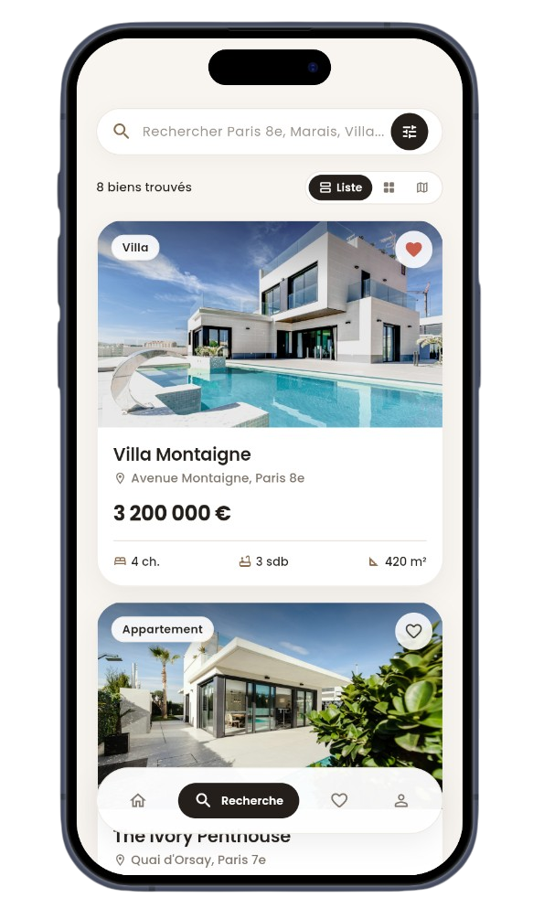
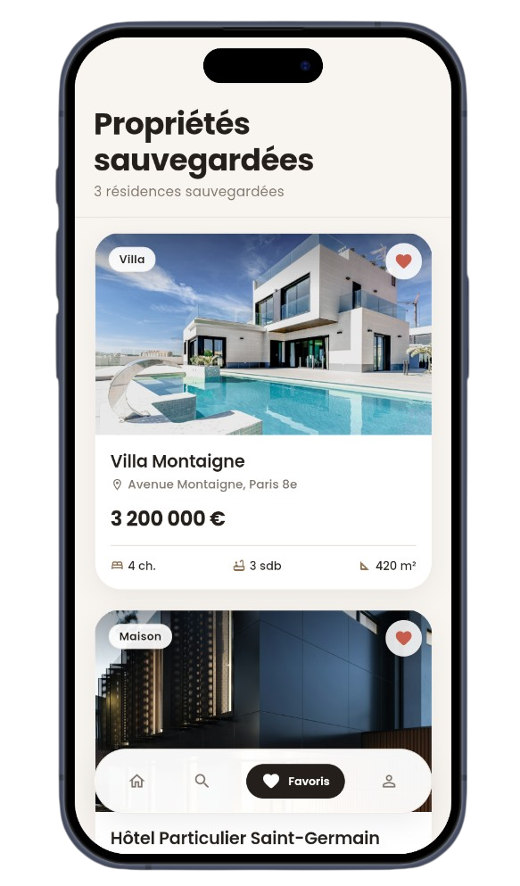
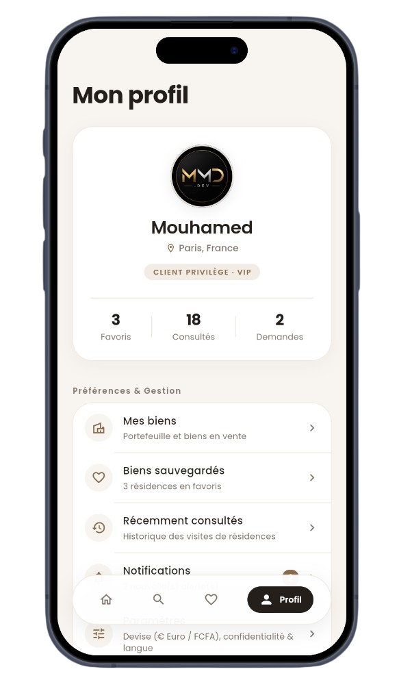

# My House — Luxury Real Estate Mobile App

A **next-generation luxury real estate mobile application** built with Flutter and Dart, featuring curated prestige residences across Paris, France, interactive map exploration, advanced multi-criteria filtering, immersive property detail showcases, real-time saved wishlist, and dedicated VIP client concierge management.

---

## Features

- Curated luxury property catalog highlighting prime residential districts across Paris, France (Paris 8e, Paris 16e, Paris 7e, Le Marais, Neuilly-sur-Seine)
- Interactive multi-view search experience with instant switching between List, 2-column Grid, and Stylized Map modes with price markers
- Advanced real-time filter sheet supporting district selection, property types (Villa, Appartement, Maison, Terrain, Bureau), interactive price range slider in Euros (€), and bedroom/bathroom steppers
- Immersive property detail showcase with full-width image slider, interactive fullscreen pinch-to-zoom gallery, expandable description, dynamic amenities grid, and stylized neighborhood vector map
- Persistent sticky bottom contact bar with price guide, instant private tour booking, and direct WhatsApp VIP concierge modal
- Real-time reactive favorites wishlist with animated heart toggle and elegant empty state handling
- VIP private client profile hub featuring personal viewing statistics, listed property management, notifications center, and account preferences
- Custom floating navigation bar with fluid micro-interactions, bounce tap feedback, and smooth animated page transitions
- Warm luxury ivory color palette with modern Poppins typography, zero layout overflow, and native Material 3 architecture

---

## Technologies Used

- **Flutter SDK** – Cross-platform framework for building native mobile applications
- **Dart** – High-performance language powering the app logic, repository layer, and UI components
- **Provider & ChangeNotifier** – Reactive centralized repository pattern driving property search, filter criteria, favorites, and notifications
- **Google Fonts (Poppins)** – Modern, clean geometric typography system across all screens and components
- **Custom Canvas Painters** – Hand-crafted vector map rendering for stylized location previews and district cartography in Paris
- **Device Preview** – Multi-device responsive design and layout testing

---

## Preview

  
  

  
  

